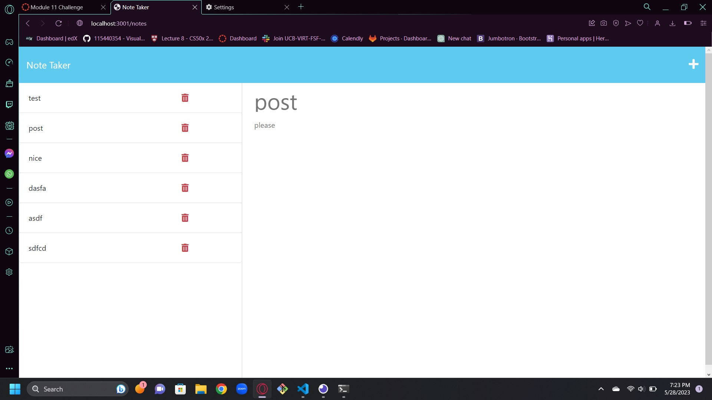

# Note taker API 
  
  ## Description

  This is a website that has a landing page and a second page where you can write and save notes. This project helped me better understand Express.js and Insomnia. My biggest struggle was manipulating the data in the way I wanted. Fortunately, Insomnia saved me a lot of headaches.

  ## Table of Contents 

  [Description](#description)

  [Installation](#installation)

  [Usage](#usage)

  [Credits](#credits)

  [License](#license)

  [Test](#test)

  [Questions](#questions)

  ## Installation
  
  Go to this link:
    https://note-taker-nathansabin.herokuapp.com

  See it on Github:
    https://github.com/nathansabin/Note-taker

  

  ## Usage

  This software is a simple note application.
  
  ## Credits
  
  I built the api and fixed the JSON database.
  
  ## License  
 
  ## Test
  
  I ran my routes through Insomnia to verify they all work and than tested everything else manually.

  ## Questions

  nathansabin

  https://github.com/nathansabin

  sabinnat001@gmail.com
